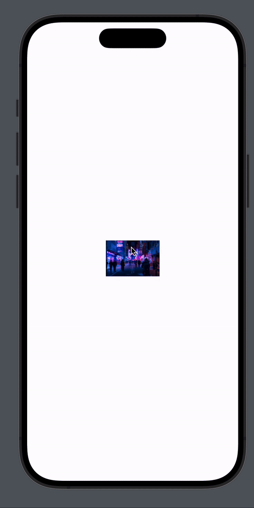
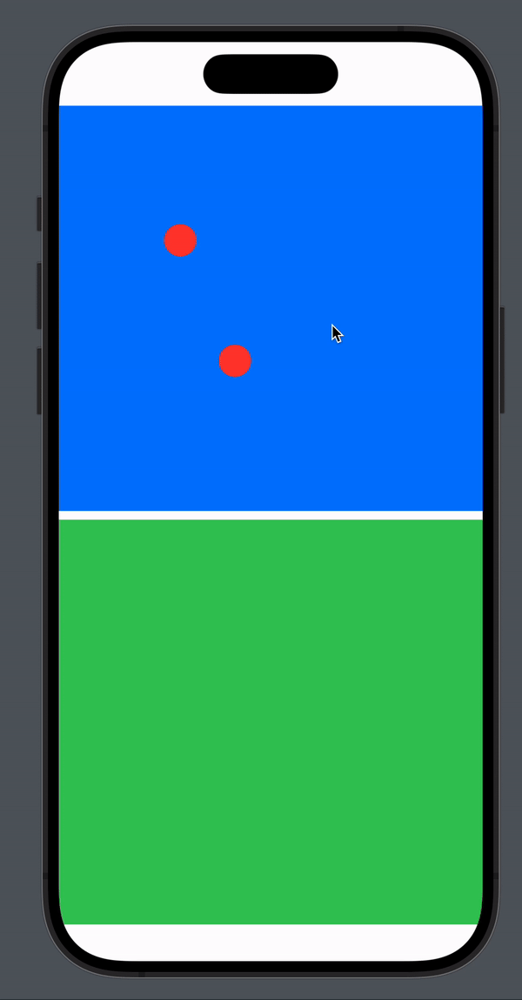

# PictooChat

This project involves the creation of a social app focused on sharing photos. Detailed instructions for the project can be found in the file `Instructions.md`.

## Process Overview

### Step 1: Project Initialization

- **Discovering the Subject**: Begin by thoroughly understanding the concept.
- **Understanding the Need**: Identify the target and the requirements.
- **Creating GitHub Repository**: Set up the project repository on GitHub to facilitate version control.
- **Mood Board Creation on Figma**: Utilize Figma to create a mood board that visually represents the theme, style, and overall ambiance of the app. This helps in setting the design direction and ensures coherence throughout the project.

### Step 2: Wireframe, Mood board & Code investigation

- **Generating Initial Ideas**: Brainstorm and sketch out initial ideas for the app's layout, features, and user interface.
- **Creating Wireframes**: Develop basic wireframes using [Figma](https://www.figma.com/file/Y74UIOG29vRh5s54mOXSmh/POC-iOS-APP?type=design&node-id=406%3A435&mode=design&t=NPDUuSdlJLVVXYY7-1) oroutline the structure and functionality of key app screens.
- **Code Experimentation**: Different style of picture galery using

> Note that you'll find all Experimentation right in the **Investigation** folder

| Image fullscreen  | Transition   | Gallery   | Chat Circle   |
|-------------|-------------|-------------|-------------|
|    |    |    |    |

### Step 3: Code Development
- **Focus on User Interface and Experience**: Prioritized developing an intuitive and engaging user interface over backend logic.
- **Use of Placeholder Data**: To expedite development, placeholder data was used instead of implementing comprehensive networking logic.
- **Exploration of UI Components**: Experimented with various UI components to enhance the visual appeal and interactivity of the app, such as custom animations, transitions, and gallery views.

### Future Steps
- **Implement Real Data Fetching**: Transition from using placeholder data to fetching real data from servers or APIs to provide dynamic content.
- **Synchronization Across Devices**: Develop functionality to synchronize app data across different users' devices in real-time, enhancing the collaborative and interactive aspects of the app.
- **Enhance Chat Functionality**: Introduce a fully functional chat system that supports real-time messaging, media sharing, and possibly end-to-end encryption for privacy.
- **Improve Image Handling**: Implement advanced image management features such as pinch-to-zoom, swipe gestures for navigation, and high-resolution image support to improve the viewing experience.
- **Strengthen Application Architecture**: If the project scales into a full app, focus on building a robust and scalable architecture that supports extensive functionalities, user growth, and maintains high performance.

## Installation

To install **PictooChat** on your iOS device, follow these steps:

1. Download the latest version of Xcode from the App Store.
2. Clone the repository to your local machine: `git clone https://github.com/Armay2/PictooChat.git`
3. Open the project in Xcode.
4. Add your own `accessKey` & `appId` to `UnsplashService`
5. Connect your iOS device to your computer.
6. Select your device as the build target in Xcode.
7. Click the "Run" button to install PictooChat on your device.

## Contributing

We welcome contributions to iSunny! If you would like to contribute, please follow these steps:

1. Fork the repository.
2. Create a new branch: `git checkout -b my-feature-branch`
3. Make your changes and commit them: `git commit -am 'Add new feature'`
4. Push to the branch: `git push origin my-feature-branch`
5. Create a new pull request.

## Feedback and Support

If you have any questions, suggestions, or encounter any issues while working on the project, please don't hesitate to reach me out !
